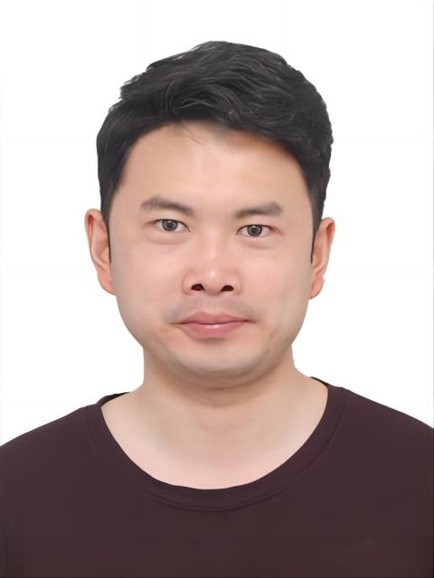



  <h1 style="margin:0;">
    张东宽 简历Curriculum Vitae — Dongkuan Zhang
  </h1>
  

    <a class="btn" href="{{ '/assets/cv/CV_Dongkuan_Zhang_CN.pdf' | relative_url }}" download>
      <i class="fa fa-download" aria-hidden="true"></i>
      中文简历CV in Chinese
    </a>
    <a class="btn" href="{{ '/assets/cv/CV_Dongkuan_Zhang_EN.pdf' | relative_url }}" download>
      <i class="fa fa-download" aria-hidden="true"></i>
      英文简历CV in English
    </a>
    <a class="btn" href="{{ '/assets/cv/CV_Dongkuan_Zhang.pdf' | relative_url }}" download>
      <i class="fa fa-download" aria-hidden="true"></i>
      中英对照Bilingual
    </a>
  

  <h2>基本信息Personal Information</h2>
  

    <table class="cv-table" style="flex:1; min-width:280px;">
      <tbody>
        <tr><td class="year">姓名Name</td><td>张东宽Dongkuan Zhang</td></tr>
        <tr><td class="year">国籍Nationality</td><td>中国Chinese</td></tr>
        <tr><td class="year">出生日期Date of Birth</td><td>02.05.1995</td></tr>
        <tr><td class="year">所在地Location</td><td>辽宁大连Dalian, Liaoning, China</td></tr>
        <tr><td class="year">电话Phone</td><td>+86 15510689505</td></tr>
        <tr><td class="year">邮箱Email</td><td><a href="mailto:dkz@mail.dlut.edu.cn">dkz@mail.dlut.edu.cn</a></td></tr>
        <tr><td class="year">语言Languages</td><td>中文（母语）、英语（流利）Mandarin (Native), English (Fluent)</td></tr>
      </tbody>
    </table>
    

      
    

  

  <h2>教育经历Education</h2>
  <table class="cv-table">
    <tbody>
      <tr><td class="year">2023 – 今Now</td><td><strong>大连理工大学Dalian University of Technology</strong> 环境科学与工程，博士（预计 2027 年毕业），导师：姬国钊 教授Ph.D. in Environmental Science and Engineering (expected 2027). Supervisor: Prof. Guozhao Ji</td></tr>
      <tr><td class="year">2020 – 2023</td><td><strong>中央民族大学Minzu University of China</strong> 环境科学与工程，硕士M.S. in Environmental Science and Engineering</td></tr>
      <tr><td class="year">2013 – 2017</td><td><strong>辽宁石油化工大学Liaoning Petrochemical University</strong> 石油工程，学士B.S. in Petroleum Engineering</td></tr>
    </tbody>
  </table>

  <h2>工作经历Work Experience</h2>
  <table class="cv-table">
    <tbody>
      <tr><td class="year">2017 – 2019</td><td><strong>浙江石油化工有限公司Zhejiang Petrochemical Co., Ltd.</strong> 柴油加氢裂化装置操作员。负责装置监控、工艺调整、采样分析、故障处置、安全管理与记录维护。Diesel hydrocracking unit operator — equipment monitoring, process adjustment, sample collection and analysis, troubleshooting, safety management and record keeping.</td></tr>
    </tbody>
  </table>

  <h2>联合培养 / 访学经历Joint Training & Visiting</h2>
  <table class="cv-table">
    <tbody>
      <tr><td class="year">2025 – 2026</td><td><strong>东京科学大学（原东京工业大学）Cross 实验室Cross Laboratory, Institute of Science Tokyo</strong> 联合培养博士生，导师：Jeffrey S. Cross 教授。资助：国家公派留学（CSC）。Joint PhD student supervised by Prof. Jeffrey S. Cross. Funded by the China Scholarship Council (CSC).</td></tr>
      <tr><td class="year">2026.09 – 2027.03</td><td><strong>卢森堡大学University of Luxembourg</strong> 联合培养博士生（6 个月），导师：Bradley P. Ladewig 教授。资助：大连理工大学"连理全球"留学专项。Joint PhD research visit (6 months), supervised by Prof. Bradley P. Ladewig. Funded by the DUT Global Vision Project.</td></tr>
    </tbody>
  </table>

  <h2>研究方向Research Interests</h2>
  <ul>
    <li><strong>面向废弃物焚烧技术的智能多相流建模</strong>：将基于物理机理的 CFD 数值模拟与 AI 驱动的流场预测相结合。<strong>Intelligent multiphase flow modeling for waste incineration</strong>: combining physics-based CFD with AI-driven flow field prediction.</li>
    <li>多相流、燃烧与传热过程的欧拉-拉格朗日数值模拟（实验室规模至工业规模）。Eulerian-Lagrangian modeling of multiphase flow, combustion and heat transfer (lab to industrial scale).</li>
    <li>机器学习与神经网络代理模型（输入凸神经网络等）用于流场快速预测与非牛顿流体建模。Machine-learning and neural-network surrogates (e.g. input-convex neural networks) for fast flow prediction and non-Newtonian fluid modeling.</li>
    <li>焚烧炉、循环流化床、双流体喷嘴等装备的流场设计、防堵与运行优化。Flow field design, anti-clogging and operational optimization of incinerators, circulating fluidized beds and twin-fluid nozzles.</li>
  </ul>

  <h2>学术成果概览Academic Output Snapshot</h2>
  
  

    <i class="fa-solid fa-quote-right" aria-hidden="true"></i>
    总被引Total citations <strong>{{ site.data.scholar.total_citations }}</strong> ·
    h-index <strong>{{ site.data.scholar.h_index }}</strong> ·
    i10-index <strong>{{ site.data.scholar.i10_index }}</strong>
    (更新于updated {{ site.data.scholar.updated_at | date: "%Y-%m-%d" }})
  

  
  <ul>
    <li>期刊论文Journal articles: <strong>11</strong> 篇papers（其中第一作者 / 共一incl. first/co-first author 5 篇papers）</li>
    <li>专利Patents: <strong>8</strong> 项patents（含已授权发明专利、实用新型与申请公布granted invention patents, utility models and published applications）</li>
    <li>软件著作权Software copyrights: <strong>2</strong> 项items</li>
    <li>团体标准Group standards: <strong>1</strong> 项（参编）(participating drafter)</li>
    <li>科技成果转化Technology transfer: <strong>1</strong> 项，成果转让金额 40 万元patent transfer, RMB 400,000</li>
  </ul>

  <h2>期刊论文Journal Articles ({{ site.publications | where: "category", "manuscripts" | size }})</h2>
  <table class="cv-table">
    <tbody>
      
      
      <tr>
        <td class="year">{{ p.date | date: "%Y" }}</td>
        <td>
          <strong>{{ p.title_cn | default: p.title }}{{ p.title_en | default: p.title }}</strong> 
          {{ p.authors_cn | default: p.authors }}{{ p.authors_en | default: p.authors }} 
          <em>{{ p.venue_cn | default: p.venue }}{{ p.venue_en | default: p.venue }}</em>
           · <a href="{{ p.paperurl }}">link</a>
           · {{ p.citation_count }} citations
        </td>
      </tr>
      
    </tbody>
  </table>
  
<a href="{{ '/publications/' | relative_url }}"><i class="fa fa-arrow-right" aria-hidden="true"></i> 查看完整出版列表（含引用数）See the full publication list with citation counts</a>

  <h2>专利Patents ({{ site.publications | where: "category", "patents" | size }})</h2>
  <table class="cv-table">
    <tbody>
      
      
      <tr>
        <td class="year">{{ p.date | date: "%Y" }}</td>
        <td>
          <strong>{{ p.title }}</strong> 
          {{ p.authors }} 
          <em>{{ p.venue }}</em>
           · <a href="{{ p.paperurl }}">Scholar</a>
        </td>
      </tr>
      
    </tbody>
  </table>

  <h2>软件著作权Software Copyrights</h2>
  <table class="cv-table">
    <tbody>
      
      
      <tr>
        <td class="year">{{ p.date | date: "%Y-%m" }}</td>
        <td><strong>{{ p.title }}</strong> <em>{{ p.venue }}</em></td>
      </tr>
      
    </tbody>
  </table>

  <h2>标准Standards</h2>
  <table class="cv-table">
    <tbody>
      
      
      <tr>
        <td class="year">{{ p.date | date: "%Y" }}</td>
        <td>
          <strong>{{ p.title }}</strong> 
          {{ p.authors }} 
          <em>{{ p.venue }}</em>
        </td>
      </tr>
      
    </tbody>
  </table>

  <h2>科研项目与科技成果转化Research Projects & Technology Transfer</h2>
  <table class="cv-table">
    <tbody>
      <tr>
        <td class="year">2023 – 2024</td>
        <td><strong>垃圾焚烧炉自降飞灰技术研发（科技成果转化）Self-settling fly ash technology for waste incinerators (technology transfer)</strong> 作为成果完成人之一，将自主研发的专利成果及相关研究成果转让给企业，转让金额 40 万元；个人获学校现金奖励 2 万元。As one of the completing researchers, transferred self-developed patent achievements and related research results to industry (RMB 400,000). Personally awarded RMB 20,000 cash incentive by the university.</td>
      </tr>
    </tbody>
  </table>

  <h2>荣誉与获奖Honors & Awards</h2>
  <table class="cv-table">
    <tbody>
      <tr><td class="year">2026.06</td><td><strong>首届环境纳米技术国际研讨会（The First International Symposium on Environmental Nanotechnology）最佳墙报奖</strong> Best Poster Award, The First International Symposium on Environmental Nanotechnology, Dalian, China. 墙报题目：Poster: <em>Optimizing hazardous waste incineration in a full-scale rotary kiln via co-firing and staged air supply</em> · <a href="../images/isen2026.jpg" target="_blank"><i class="fa fa-image" aria-hidden="true"></i> certificate</a></td></tr>
      <tr><td class="year">2026.04</td><td><strong>大连理工大学"连理全球"留学专项资助</strong> DUT Global Vision Project Funding (University of Luxembourg, 6-month joint PhD visit).</td></tr>
      <tr><td class="year">2025.12</td><td><strong>教育部 2025 春晖海外青年优秀成果（创新创业类）</strong> 2025 Chunhui Overseas Young Excellent Achievement Collection (MOE of China). Project: "Crisis-Flow Control: Flow-field-based Hazardous Waste Incineration & Disposal Technology and Equipment."</td></tr>
      <tr><td class="year">2025.09</td><td><strong>博士研究生国家奖学金</strong> National Scholarship for Doctoral Students (Ministry of Education of China).</td></tr>
      <tr><td class="year">2025.11</td><td><strong>第 12 届中日韩清洁能源与可持续环境研讨会（日本山梨）报告证书</strong> 12th Japan-China-Korea Joint Symposium on Clean Energy and Sustainable Environment, Yamanakako, Japan — Presentation Certificate.</td></tr>
      <tr><td class="year">2025.01</td><td><strong>团体标准 T/CITS 242-2025《基于高温热解气化的垃圾制氢技术要求》起草人证书</strong> Drafter Certificate, Group Standard T/CITS 242-2025, China Inspection and Testing Society.</td></tr>
      <tr><td class="year">2024.12</td><td><strong>大连理工大学 2024 年度"环境工程之星"</strong> "Environmental Engineering Star" (Dalian University of Technology).</td></tr>
      <tr><td class="year">2024.11</td><td><strong>2024 韩中日能源环境联合研讨会（韩国延世大学）优秀报告奖</strong> Award for Excellent Presentation, 2024 Korea-China-Japan Joint Symposium on Energy and Environment (Yonsei University).</td></tr>
      <tr><td class="year">2024.11</td><td><strong>国家公派留学资格（CSC 公派证书）</strong> China Scholarship Council (CSC) Government-Sponsored Studentship (CSC No. 202406060182).</td></tr>
      <tr><td class="year">2024</td><td><strong>科技成果转化现金奖励（2 万元）</strong> Cash incentive for technology transfer (RMB 20,000), Dalian University of Technology.</td></tr>
    </tbody>
  </table>

  <h2>技术技能Technical Skills</h2>
  <table class="cv-table">
    <tbody>
      <tr><td class="year">CFD 模拟CFD</td><td>ANSYS Fluent、Star-CCM+、COMSOL Multiphysics；多相流、燃烧、传热建模。ANSYS Fluent, Star-CCM+, COMSOL Multiphysics; multiphase flow, combustion and heat transfer modeling.</td></tr>
      <tr><td class="year">编程Programming</td><td>Python（含 PyTorch、NumPy、SciPy）、MATLAB；数据分析与可视化。Python (PyTorch, NumPy, SciPy), MATLAB; data analysis and visualization.</td></tr>
      <tr><td class="year">实验Experiment</td><td>流场测试、传热实验、采样与表征。Flow-field testing, heat-transfer experiments, characterization.</td></tr>
    </tbody>
  </table>

  <a href="{{ '/assets/cv/CV_Dongkuan_Zhang_CN.pdf' | relative_url }}" download class="btn"><i class="fa fa-download" aria-hidden="true"></i> 下载中文简历Download CV (Chinese)</a>
  <a href="{{ '/assets/cv/CV_Dongkuan_Zhang_EN.pdf' | relative_url }}" download class="btn"><i class="fa fa-download" aria-hidden="true"></i> 下载英文简历Download CV (English)</a>
  <a href="{{ '/assets/cv/CV_Dongkuan_Zhang.pdf' | relative_url }}" download class="btn"><i class="fa fa-download" aria-hidden="true"></i> 下载中英对照Download CV (Bilingual)</a>

